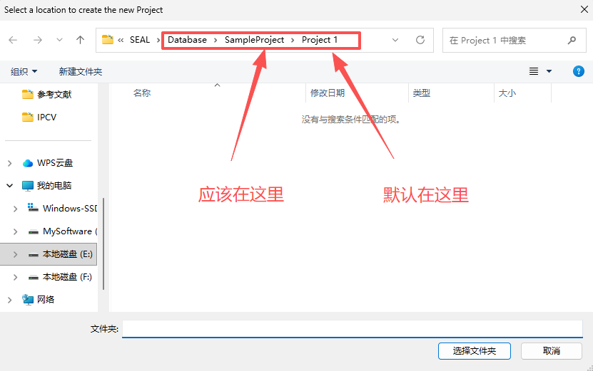

# SEAL 项目文档

## 项目概述

SEAL 是一个用于 MEG/EEG 源成像分析的 MATLAB 平台，采用模块化架构设计，具有以下特点：

- **节点系统**: 采用树形节点系统管理所有数据，所有节点继承自 `BaseNode` 抽象基类
- **数据与元数据分离**: 真实数据存储在文件系统中，内存中仅维护元数据和路径引用
- **按需加载**: 大数据集按需加载，避免内存溢出
- **可扩展架构**: 支持插件和算法扩展

## 更新日志

### 2026/01/31

#### 项目结构重组

完成了项目结构的重组，提高了代码组织性：

1. **目录结构优化**:
   - 将 `GUI/` 重命名为 `app/`
   - 将 `CoreFunctions/` 重命名为 `core/functional/`
   - 将 `models/` 移动到 `core/infos/`
   - 将 `core/nodes/` 保持不变
   - 将 `Database/` 重命名为 `sample/data/`
   - 将 `External/` 重命名为 `external/`
   - 将 `utilities/` 保持不变
   - 将文档文件移到 `docs/` 目录

2. **新增目录**:
   - `docs/`: 存放所有文档文件
   - `sample/`: 存放示例数据和项目
   - `sample/data/`: 示例数据集
   - `sample/proj/`: 示例项目

3. **新增文档**:
   - `coding_standards.md`: 编码规范文档

#### 节点系统重构

完成了核心节点系统的重构，采用面向对象设计：

1. **BaseNode 抽象基类**: 
   - 提供统一的节点接口和树形结构管理
   - 支持父子关系管理
   - 提供按需加载机制
   - 支持事件通知

2. **具体节点实现**:
   - ProjectNode: 项目节点，根节点
   - ProtocolNode: 协议节点，包含通道、皮层、导联场和会话
   - SessionNode: 会话节点，包含数据
   - DataNode: 数据节点，管理数据文件
   - ChanlocsNode: 通道节点，管理通道信息
   - CortexNode: 皮层节点，管理皮层信息
   - LeadfieldNode: 导联场节点，管理导联场信息

3. **Info 类系统**:
   - ProjectInfo: 项目信息管理
   - ProtocolInfo: 协议信息管理
   - SessionInfo: 会话信息管理
   - DataInfo: 数据信息管理
   - ChanlocsInfo: 通道信息管理
   - CortexInfo: 皮层信息管理
   - LeadfieldInfo: 导联场信息管理

#### 数据字典完善

建立了完整的数据字典文档，详细描述了所有节点和 Info 类的属性、方法和依赖关系。

#### 项目结构文档更新

更新了项目结构文档，反映了当前的目录结构和架构设计。

### 2025/11/6

#### 工程性问题

我们急需一个数据字典，目前 NodeData 等结构内容纷杂，同时包含大量类似于FilteredData、ResultData等并列类，应当统一定义结构，根据属性来区分不同，面向抽象编程，同时，上述三个类违背了依赖导致原则，即从功能上看FilteredData作为NodeData的子类，却无法替换NodeData承担功能，从工程上讲应当保证继承功能而非属性。

（待议，近期正在整理，预计下周给出）

#### 发现目录树结构问题

从数据地位上，分析前的原始数据、经过滤波器的数据地位应当等价，并不适合分开在两个文件夹储存，这导致了在 load 一个Project的时候，能够成功加载原始数据，但是经过滤波的数据无法正常加载，应当在定义数据结构的时候用一个字段来表明这个数据经过了哪些操作。

此外，我认为有关目录结构的所有操作，应当都在GUI中封装方法，一个节点修改理论上至少需要刷新其父节点，是否需要迭代至根取决于具体需求，外部仅能作调用而非直接修改树结构，即将所有树操作委托给树本身。

（会在根据数据字典定义结构后重构该模块）

#### 码风问题

希望能够统一编码规范如：

变量和函数名：使用驼峰式命名，例如 myVariable，calculateSum

常量：使用大写字母和下划线，例如 MAX_SIZE

类名：使用帕斯卡命名法，即每个单词首字母大写，例如 MyClass，NodeData

文件名：通常与文件中的主要函数或类名相同，使用驼峰

（逐步修改）

### 2025/11/1

#### 鲁棒性增强

部分重构项目，增强鲁棒性，例如原始写法中大量存在的 `str ~= 0` ，修正为 `~isequal(str, 0) && ~isempty(strtrim(str))`。

#### 交互逻辑增强

1. New Project

    原始写法中，创建项目的默认路径为`app.ProjectPath`，即上一个创建的项目的根目录，但实际交互应当是上一次创建项目位置，修正为上一次创建的项目的根目录的父级，此外默认项目名未作重复检查，已加入。

    

2. New Protocol

    与New Project同理。

3. Preprocess
   
   更新了滤波逻辑，去除了原先复杂的逻辑组合，转为高通-低通-陷波级联处理，同时，在保存滤波后数据的同时，复制原文件的各类元信息，包括`Type`、`Chanlocs`、`srate`等，修复保存结构中`Data`的字段名为`data`，使得保存后的文件可以被添加进protocol列表进一步打开进行后续操作，现在允许用户指定预处理后的文件名。

4. load/delete
   
   修复了大量有关脏路径引发的异常，修复大量覆写引发的异常，修复大量未刷新节点导致的异常。

## 项目架构概述

下面是 SEAL 仓库的高层架构说明，面向开发者与维护者，包含模块分层、典型数据流、主要入口与改进建议。

### 顶层模块与职责

- `app/`：包含多个 MATLAB App (`*.mlapp`)`)，主页面为 `SEAL_GUI.mlapp`、`SEAL_Preprocess.mlapp`、`SEAL_showCortex.mlapp` 等。负责用户交互、参数输入和可视化。

- `algorithms/`：实现源定位算法`seal_MNE.m`、`seal_LORETA.m`、`seal_sLORETA.m`、`seal_eLORETA.m`、`seal_LAURA.m`、`seal_dSPM.m`，时空方法 `seal_BlockChampagne.m`、`seal_STARTS.m`、`seal_uSTAR.m`。接受预处理数据与前向模型，输出源估计。

- `core/functional/`：通用函数库，数据导入 `sealImporter.m`、绘图 `PlotSource.m`、网格平滑工具 `tessSmooth.m`、`getSmoothedVertices.m` 等，以及滤波设计脚本`filter/` 子目录。

- `utilities/`：预处理工具集合，如 `applyDownsampleResample.m`、`applyRereference.m`、`runInterpolation.m`、`runLaplacian.m` 等。

- `sample/`：示例数据与前向模型`LeadField_*.mat`、`Cortex_*.mat`、`ERPset.mat`，按项目/协议分目录存放示例输入与结果。

- `external/`：第三方依赖代码例如 `eeglab/` 和 `Newtopoplot1.1/`提供 ICA、topoplot 等功能扩展。

- `core/nodes/`：核心节点系统，包含所有节点类定义。

- `core/infos/`：数据模型类，包含所有 Info 类定义。

### 典型数据与文件格式

- 输入：MATLAB `.mat`EEG/ERP 数据、实验数据集，未来兼容 EEGLAB 格式。

- 前向模型/导联：`.mat` 文件，包含 lead field 矩阵和通道映射。

- 皮层网格：`.mat`顶点与面片数据。

- 输出：源估计或统计映射 `.mat` 文件，以及 GUI 可视化结果。

### 高层运行流程（数据流）

1. 启动 GUI（`app/SEAL_GUI.mlapp`）。

2. 导入数据（`core/functional/sealImporter.m`），统一通道顺序与元数据。

3. 预处理（`core/functional/`）：滤波、降采样、重参考、插值、拉普拉斯等。

4. 加载前向模型（`sample/`），对齐通道。

5. 运行算法（`algorithms/`）计算源空间时间序列或统计图。

6. 后处理与可视化（`core/functional/PlotSource.m`、`app/SEAL_showCortex*`），保存结果到 `sample/proj/` 等目录。

### 主要入口与调用契约

- GUI 主入口：`app/SEAL_GUI.mlapp`（用于交互式操作）。

### 依赖与运行环境

- MATLAB。

## 节点系统设计

### 节点类型

1. **ProjectNode**: 项目节点，根节点
2. **ProtocolNode**: 协议节点，包含通道、皮层、导联场和会话
3. **SessionNode**: 会话节点，包含数据
4. **DataNode**: 数据节点，管理数据文件
5. **ChanlocsNode**: 通道节点，管理通道信息
6. **CortexNode**: 皮层节点，管理皮层信息
7. **LeadfieldNode**: 导联场节点，管理导联场信息

### 节点生命周期

1. **创建创建新节点
2. **打开**: 使用 `openExisting()` 打开现有节点
3. **加载**: 调用 `load()` 方法加载数据到内存
4. **保存**: 调用 `save()` 方法保存数据到磁盘
5. **卸载**: 调用 `unload()` 方法释放内存
6. **删除**: 调用 `deleteFromDisk()` 方法从磁盘删除

### 节点特性

- **树形结构**: 支持父子关系管理
- **按需加载**: 大数据集按需加载，避免内存溢出
- **事件通知**: 支持节点事件通知
- **双向绑定**: 父子节点双向绑定
- **元数据管理**: 支持元数据管理

## 数据层级关系

```
ProjectNode (项目)
  └── ProtocolNode (协议)
      ├── ProtocolInfo
      ├── ChanlocsNode (通道)
      ├── CortexNode (皮层)
      ├── LeadfieldNode (导联场)
      └── SessionNode (会话)
          ├── SessionInfo
          └── DataNode (数据)
              ├── DataInfo
              ├── data (数据缓存)
              └── result (结果缓存)
```

## 算法库

### 最小L2范数算法

- **MNE**: 最小范数估计
- **LORETA**: 低分辨率电磁层析成像
- **sLORETA**: 标准化LORETA
- **eLORETA**: 精确LORETA
- **LAURA**: 局部自回归平均
- **dSPM**: 动态统计参数映射

### 时空算法

- **BlockChampagne**: Block Champagne算法
- **STARTS**: Spatio-Temporal Re-weighted Source Analysis
- **uSTAR**: Unconstrained Spatio-Temporal Re-weighted Source Analysis

## 预处理功能

- **滤波**: 高通、低通、带通、带阻滤波器
- **降采样**: 降低采样率
- **重参考**: 重新参考
- **插值**: 插值处理
- **拉普拉斯**: 拉普拉斯变换

## 可视化功能

- **EEG显示**: 时域、频域、拓扑图显示
- **皮层显示**: 3D皮层模型显示
- **源成像结果**: 源估计结果可视化

## 测试

项目包含以下测试文件：

- **TestProjectNode.m**: 项目节点测试
- **TestProtocolNode.m**: 协议节点测试
- **TestChannelNode.m**: 通道节点测试
- **TestExternalProtocol.m**: 外部协议测试
- **TestSEALIntegration.m**: 集成测试

## 外部依赖

### Newtopoplot1.1

拓扑图插件，提供EEG拓扑图绘制功能。

### Brainstorm

Brainstorm工具，提供部分辅助功能。

### EEGLAB

EEGLAB工具，提供ICA等功能。

## 文档

项目包含以下文档：

- **README**.md**: 项目说明
- **coding_standards.md**: 编码规范
- **data_dict.md**: 数据字典
- **document.md**: 项目文档（本文件）
- **proj_structure.md**: 项目结构说明
- **requirements_analysis.md**: 需求分析
- **storage_structure.md**: 存储结构说明

## 开发指南

### 代码规范

- 变量和函数名：使用驼峰式命名，例如 myVariable，calculateSum
- 常量：使用大写字母和下划线，例如 MAX_SIZE
- 类名：使用帕斯卡命名法，即每个单词首字母大写，例如 MyClass，NodeData
- 文件名：通常与文件中的主要函数或类名相同，使用驼峰

详细的编码规范请参考 [coding_standards.md](coding_standards.md)。

### 设计模式

- **抽象工厂模式**: 节点创建使用静态工厂方法
- **组合模式**: 树形节点系统
- **模板方法模式**: BaseNode定义抽象方法，子类实现具体逻辑

### 扩展指南

#### 添加新节点

1. 继承 `BaseNode` 类
2. 实现抽象属性 `type` 和 `name`
3. 实现抽象方法 `load()`、`unload()`、`open()`、`save()`、`deleteFromDisk()`
4. 创建对应的 Info 类
5. 在父节点中添加子节点管理方法

#### 添加新算法

1. 在 `algorithms/` 目录下创建新算法文件
2. 实现算法逻辑
3. 在GUI中添加算法选择界面

#### 添加新预处理功能

1. 在 `core/functional/` 目录下创建新功能文件
2. 实现功能逻辑
3. 在GUI中添加预处理界面
