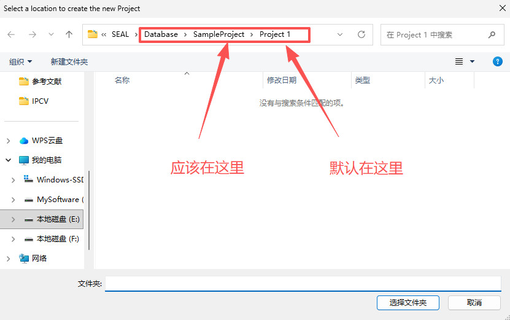

# SEAL

##  更新日志

### 2025/11/1

#### 鲁棒性增强

部分重构项目，增强鲁棒性，例如原始写法中大量存在的 `str ~= 0` ，修正为 `~isequal(str, 0) && ~isempty(strtrim(str))`。

#### 交互逻辑增强

1. New Project

    原始写法中，创建项目的默认路径为`app.ProjectPath`，即上一个创建的项目的根目录，但实际交互应当是上一次创建项目位置，修正为上一次创建的项目的根目录的父级，此外默认项目名未作重复检查，已加入。

    

2. New Protocol

    与New Project同理。

## 项目架构概述

下面是 SEAL 仓库的高层架构说明，面向开发者与维护者，包含模块分层、典型数据流、主要入口与改进建议。

### 顶层模块与职责

- `GUI/`：包含多个 MATLAB App (`*.mlapp`)，主页面为 `SEAL_GUI.mlapp`、`SEAL_Preprocess.mlapp`、`SEAL_showCortex.mlapp` 等。负责用户交互、参数输入和可视化。

- `Algorithms/`：实现源定位算法`seal_MNE.m`、`seal_LORETA.m`、`seal_sLORETA.m`、`seal_eLORETA.m`、`seal_LAURA.m`、`seal_dSPM.m`，时空方法 `seal_BlockChampagne.m`、`seal_STARTS.m`、`seal_uSTAR.m`。接受预处理数据与前向模型，输出源估计。

- `CoreFunctions/`：通用函数库，数据导入 `seal_importer.m`、好像是绘图？`PlotSource.m`、网格平滑工具 `tess_smooth.m`、`getSmoothedVertices.m` 等，以及滤波设计脚本`Datal/` 子目录。

- `Utilities/`：预处理工具集合，如 `applyDownsample_resample.m`、`applyRereference.m`、`run_interpolation.m`、`run_laplacian.m` 等。

- `Database/`：示例数据与前向模型`LeadField_*.mat`、`Cortex_*.mat`、`ERPset.mat`，按项目/协议分目录存放示例输入与结果。

- `External/`：第三方依赖代码例如 `eeglab/` 和 `Newtopoplot1.1/`提供 ICA、topoplot 等功能扩展。

- `Project 2/`：示例协议与结果，包含 `Protocol_1/`、`Protocol_2/` 等，可用作演示与回归验证。

### 典型数据与文件格式

- 输入：MATLAB `.mat`EEG/ERP 数据、实验数据集，未来兼容 EEGLAB 格式。

- 前向模型/导联：`.mat` 文件，包含 lead field 矩阵和通道映射。

- 皮层网格：`.mat`顶点与面片数据。

- 输出：源估计或统计映射 `.mat` 文件，以及 GUI 可视化结果。

### 高层运行流程（数据流）

1. 启动 GUI（`GUI/SEAL_GUI.mlapp`）。

2. 导入数据（`CoreFunctions/seal_importer.m`），统一通道顺序与元数据。

3. 预处理（`Utilities/`）：滤波、降采样、重参考、插值、拉普拉斯等。

4. 加载前向模型（`Database/`），对齐通道。

5. 运行算法（`Algorithms/`）计算源空间时间序列或统计图。

6. 后处理与可视化（`CoreFunctions/PlotSource.m`、`GUI/SEAL_showCortex*`），保存结果到 `Project 2/` 等目录。

### 主要入口与调用契约

- GUI 主入口：`GUI/SEAL_GUI.mlapp`（用于交互式操作）。

### 依赖与运行环境

- MATLAB。

